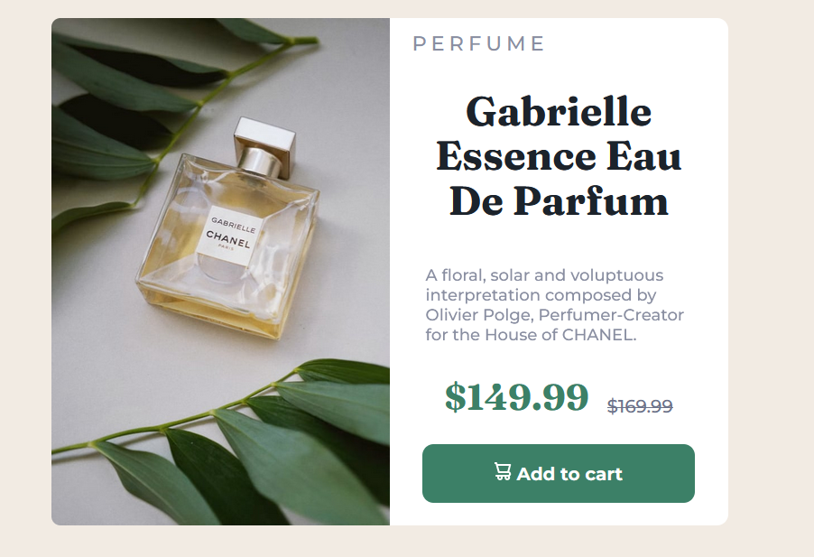

# Frontend Mentor - Product preview card component solution

This is a solution to the [Product preview card component challenge on Frontend Mentor](https://www.frontendmentor.io/challenges/product-preview-card-component-GO7UmttRfa). Frontend Mentor challenges help you improve your coding skills by building realistic projects.

## Table of contents

- [Overview](#overview)
  - [The challenge](#the-challenge)
  - [Screenshot](#screenshot)
  - [Links](#links)
  - [Built with](#built-with)
  - [What I learned](#what-i-learned)
  - [Continued development](#continued-development)
  - [Useful resources](#useful-resources)
- [Author](#author)

## Overview

### The challenge

Users should be able to:

- View the optimal layout depending on their device's screen size
- See hover and focus states for interactive elements

### Screenshot

A screenshot from the desktop version of the project.



A screenshot from the mobile version of the project.


### Links

- Solution URL: [Github](https://github.com/elic4vet/product-preview)
- Live Site URL: [Netlify](https://product-preview-23.netlify.app/)

### Built with

- Semantic HTML5 markup
- CSS custom properties
- Flexbox
- CSS Grid
- Mobile-first workflow
- HTML
- CSS

### What I learned

Use this section to recap over some of your major learnings while working through this project. Writing these out and providing code samples of areas you want to highlight is a great way to reinforce your own knowledge.

To see how you can add code snippets, see below:

```html
<p class="og-price"><s>$169.99</s></p>
```

```css
@media (min-width: 768px) and (max-width: 1279px) {
  .mobile-image {
    display: inline-block;
  }
  .desktop-image {
    display: none;
  }
  .product-title {
    font-size: 2rem;
  }
  .btn {
    padding: 1rem 2rem;
  }
  .container {
    grid-template-columns: 1fr;
    display: flex;
    flex-direction: column;
    align-items: center;
  }
  .right-side {
    order: 2;
  }
  .left-side {
    order: 1;
  }
}
```

### Continued development

The main challenge and the main focus of the app was the resposiveness of the app. I used media queries to make the app responsive. I also used flexbox and grid to make the app responsive. I also used the mobile first approach to make the app responsive. Lastly, i fixed a bug that was causing the app to be unresponsive for the tablet / ipad sizes. I fixed the bug by using the order property in css.

### Useful resources

- [A Complete Guide to Flexbox](https://css-tricks.com/snippets/css/a-guide-to-flexbox/) - This helped me understand flexbox. I'd recommend it to anyone still learning this concept.
- [Grid template columns ](https://developer.mozilla.org/en-US/docs/Web/CSS/grid-template-columns) - This is an amazing article which helped me finally understand grid template columns. I'd recommend it to anyone still learning this concept.

## Author

- Website - [Elisabeth Erkekoglou ](https://www.linkedin.com/in/eerkekoglou/)
- Frontend Mentor - [@elic4vet](https://www.frontendmentor.io/profile/elic4vet)
- Instagram - [@elisa.codes23](https://www.instagram.com/elisa.codes23/)
